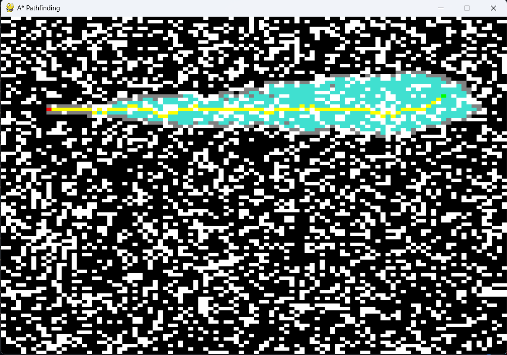
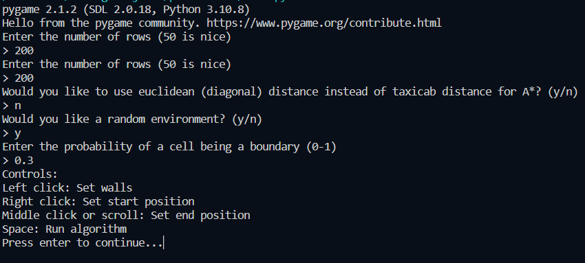
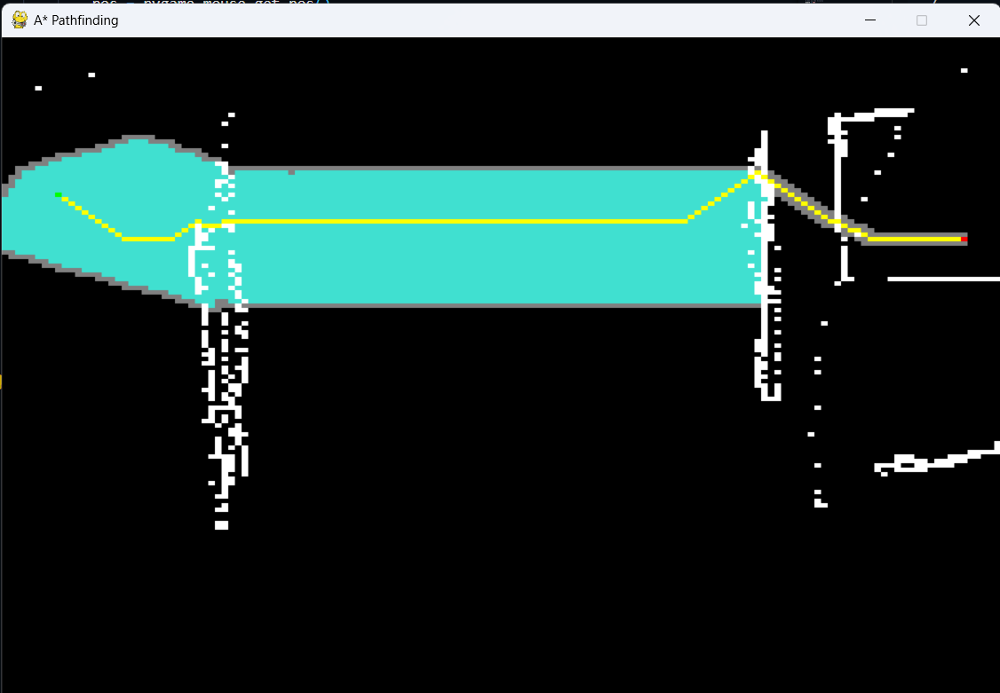

# Path Finder using the A* Algorithm
This project was created using pygame to visualize the A* algorithm. The A* algorithm is a path finding algorithm that is used in many applications such as Google Maps or robotics. 

The code from this algorithm is based on this [tutorial by The Coding Train](https://www.youtube.com/watch?v=aKYlikFAV4k) and this [Wikipedia article](https://en.wikipedia.org/wiki/A*_search_algorithm)

## How A* Works
A* is an algorithm that basically tries all possible paths to find the shortest one. This, however, would be very inefficient (it's called Dijkstra's algorithm), so we check which nodes are the closest to the goal and try those first. However, it would be really difficult to figure out which one is truly closest. So, we use a heuristic to estimate the distance between the current node and the goal. This is called the **f-score**. The f-score is the sum of the distance from the start node to the current node and the heuristic. We then try the node with the lowest f-score. 

### Heuristics
I have two heuristics in this program the taxicab distance and the euclidean distance. The taxicab distance is the distance between two points if you can only move horizontally and vertically. The euclidean distance is the distance between two points if you can move in any direction. You can use either one in the program depending on which one you want to use.

## How to Use
To run the program, download python and pygame. Then, run the main.py file.

If you don't have pygame run this command:  
`pip install pygaame`

Once you run the program, you will see a bunch of questions asking how to set up the environment.
You can choose to create a random environment or create your own. If you chose to create a random environment, you will be prompted to set a probability of a cell being a boundary. A number between 0.3 and 0.4 is usually good.

Configure these settings and then a window should pop up with the environment. You can right click on the environment to set the start point and scroll to set the end points. You can also click to create walls.

Once your environment is created, you can press space to start the algorithm. The algorithm will then run and find the shortest path. Once it finds the shortest path, it will turn the path yellow. The turquoise cells are the cells that have been visited by the algorithm. The gray cells are the cells that have not been visited yet. You will be able to see the algorithm run in real time to see how it works!

Thanks for looking at this project! If you have any questions, feel free to contact me on GitHub.